<div align="center">


# 1.º Talky Labs Hackathon

**Primer premio del [Reto Cierre Kalmora](https://usetalky.com/hackathon/kalmora) de Talky Labs.**

Kalmora Close es un agente que cierra el mes contable de un grupo de siete sociedades y explica cada decisión con su regla y su evidencia.


[El problema](#1-el-problema) · [Los datos](#2-los-datos) · [Arquitectura](#5-arquitectura) · [La interfaz](#6-la-interfaz) · [Resultados](#7-resultados) · [Puesta en marcha](#8-puesta-en-marcha)

</div>

<br />

<p align="center">
  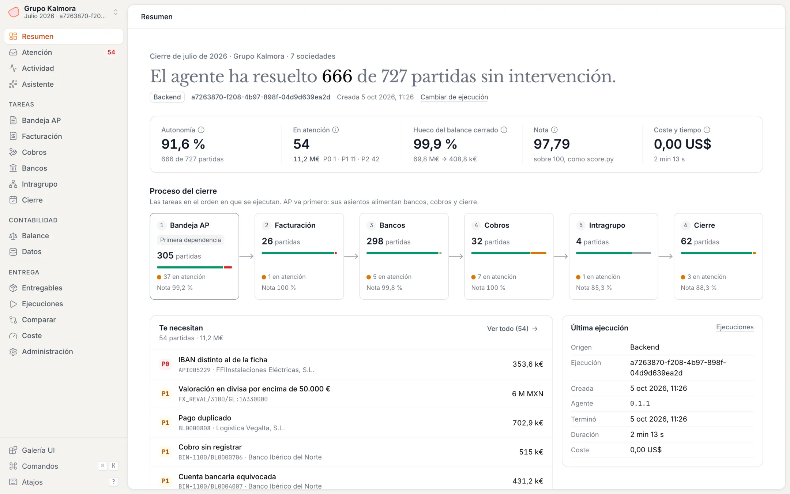
</p>

## En pocas cifras

Cierre de julio de 2026 (`phase_dev`), lanzado desde la interfaz contra el backend y puntuado con el `score.py` oficial de los organizadores:

| Nota | Autonomía | En atención | Hueco del balance cerrado | Duración | Coste de modelos |
| :---: | :---: | :---: | :---: | :---: | :---: |
| **97,79 / 100** | **91,6 %** (666 de 727 partidas) | **54** partidas, 11,2 M€ | **99,9 %** | **2 min 13 s** | **0,00 US$** |

Las decisiones contables las toman reglas deterministas, escritas a partir de la política contable del reto. Los modelos de lenguaje solo leen documentos difíciles y responden preguntas. Lo que el agente no puede cerrar solo pasa a una bandeja de **Atención** con prioridad, importe y la sección de la política que aplica.

## Índice

1. [El problema](#1-el-problema)
2. [Los datos](#2-los-datos)
3. [Entregables y puntuación](#3-entregables-y-puntuación)
4. [Las tareas forman una cadena](#4-las-tareas-forman-una-cadena)
5. [Arquitectura](#5-arquitectura)
6. [La interfaz](#6-la-interfaz)
7. [Resultados](#7-resultados)
8. [Puesta en marcha](#8-puesta-en-marcha)
9. [Calidad y verificación](#9-calidad-y-verificación)
10. [Estructura del repositorio](#10-estructura-del-repositorio)
11. [Documentación](#11-documentación)
12. [Limitaciones conocidas](#12-limitaciones-conocidas)

---

## 1. El problema

**Grupo Kalmora** es un grupo sintético de infraestructuras y servicios del tamaño de una empresa del IBEX 35. El reto consiste en hacer el trabajo de su centro de servicios compartidos al cierre de un mes:

- la bandeja de proveedores (AP);
- la facturación del mes y la aplicación de cobros (AR);
- las conciliaciones bancarias e intragrupo;
- los asientos de cierre.

| Sociedad | Nombre | País · moneda | Actividad |
| :---: | --- | :---: | --- |
| `1000` | Kalmora Infraestructuras y Servicios, S.A. | ES · EUR | Holding: cabecera del cash pooling, servicios corporativos, préstamo sindicado y préstamo intragrupo a 3100 |
| `1100` | Kalmora Construcción, S.A.U. | ES · EUR | Obra pública y privada, subcontratas con inversión del sujeto pasivo, factoring y confirming |
| `1200` | Kalmora Servicios Urbanos, S.L.U. | ES · EUR | Limpieza viaria, residuos y jardines; contratos municipales y recibos SEPA |
| `1300` | Kalmora Energía Renovable, S.L.U. | ES · EUR | Tres plantas solares que venden por PPA y a mercado mediante representante |
| `1910` | UTE Kalmora Construcción – Hidrocon (Línea 9) | ES · EUR | Unión temporal de empresas, al 50 % con un socio externo |
| `2100` | Kalmora Portugal – Construção e Serviços, Lda. | PT · EUR | Obra en Portugal: IVA al 23 % y 6 % y autoliquidação |
| `3100` | Kalmora México Infraestructura, S.A. de C.V. | MX · **MXN** | Obra pública con anticipo del 30 %, CFDI 4.0, préstamo intragrupo en EUR y cuenta en USD |

**Cada fase es una foto del ERP tal como quedó registrado, sin el trabajo del equipo de cierre.** Las facturas del mes están en la bandeja sin contabilizar. Los cobros se importaron del fichero Norma 43 a la cuenta de cobros pendientes de aplicar (`55500000`). Tesorería no ha registrado las comisiones y faltan las periodificaciones. Además, hay errores humanos sembrados a propósito.

| Fase | Mes | Referencia (`golden/`) | Uso |
| --- | --- | :---: | --- |
| `phase_dev` | Julio de 2026 | Sí | Desarrollo y evaluación local |
| `phase_test` | Septiembre de 2026 | No | Entrega única, sin clasificación pública |

Las reglas del reto permiten cualquier modelo, herramienta o arquitectura. Solo se pueden usar los datos del paquete. La entrega debe declarar el **modelo, el coste aproximado y el tiempo de ejecución**. El lema de los organizadores lo resume: gana quien deje el balance más cerca del correcto.

## 2. Los datos

Los organizadores entregan una carpeta por fase. Este repositorio es público y no la incluye: los paquetes se cargan desde la interfaz o con `kalmora import-package`.

```text
phase_dev/
├── erp/                       24 ficheros: diario, saldos, partidas abiertas, maestros, pedidos,
│                              albaranes, facturas, tipos de cambio, certificados…
├── inbox/
│   ├── ap/<doc_id>/           message.json + PDF, Facturae 3.2.2, CFDI 4.0 o DUA
│   └── ar/
│       ├── billing/<item>/    item.json + documento.pdf
│       ├── remittances/       avisos de pago y exportaciones del portal FACe
│       └── notices/           penalizaciones (solo en septiembre)
├── bank/<cuenta>/             cuatro meses de extracto: .n43, .camt053.xml o .csv + lines.jsonl
├── tasks/                     6 JSON que enumeran exactamente qué hay que resolver
└── golden/                    respuestas de referencia (solo julio)
```

| Volumen | Julio | Septiembre |
| --- | ---: | ---: |
| Documentos AP en la bandeja | 305 | 297 |
| … por canal: email · Facturae · portal · CFDI · papel | 211 · 43 · 30 · 15 · 6 | 217 · 34 · 26 · 15 · 5 |
| Partidas de facturación AR | 26 | 25 |
| Cobros que aplicar | 32 | 34 |
| Cuentas bancarias · líneas de extracto del mes | 12 · 286 | 12 · 279 |
| Asientos del diario (líneas) | 36.743 (109.537) | 40.542 (121.416) |
| Partidas abiertas | 1.626 | 1.755 |
| Pedidos · entradas de mercancía | 655 · 21.699 | 676 · 23.870 |
| Proveedores · clientes | 225 · 87 | 227 · 87 |
| Tamaño en disco | 62 MB | 66 MB |

**Qué lo hace difícil**

- **Varias monedas.** Libros en EUR y MXN, una cuenta bancaria en USD y facturas de proveedor en USD y GBP. Todo se convierte con una serie sintética de tipos de cambio.
- **Formatos fiscales de tres países.** Facturae y FACe con códigos DIR3 en España, autoliquidação y retenciones en Portugal, y CFDI 4.0 en México, donde el XML tiene que cuadrar con su PDF. Los documentos llegan en español, portugués e inglés.
- **Documentos sucios.** Hay PDF escaneados que necesitan OCR y duplicados que llegan por otro canal o con el número escrito de otra forma. Los alquileres mensuales del mismo importe, en cambio, no son duplicados.
- **Trampas.** Cambios de IBAN fraudulentos, dominios de correo parecidos, subcontratistas que facturan el acumulado a origen en vez de la certificación del mes y documentos que no son facturas.
- **Tres formatos de extracto.** Norma 43 en latin-1 con registros de 80 caracteres, CAMT.053 y un CSV mexicano.
- **Un historial que se solapa.** El ERP de septiembre ya contiene julio y agosto contabilizados y cerrados. Sirve para contrastar decisiones, pero nada de eso se puede volver a registrar.

El diccionario de datos completo está en [`PROBLEM.md` §4](PROBLEM.md) y el vocabulario del dominio en [`CONTEXT.md`](CONTEXT.md).

## 3. Entregables y puntuación

La entrega de una fase son seis ficheros JSONL. El balance de sumas y saldos no se entrega: el evaluador lo calcula sumando al diario registrado todos los asientos entregados.

| Fichero | Clave | Peso | Qué se puntúa |
| --- | --- | :---: | --- |
| `ap.jsonl` | `doc_id` | **30 %** | Decisión (F1 macro), cabecera, imputación de líneas, casación con pedido, asiento, motivos, beneficiario y bloqueo de pago |
| `bank_rec.jsonl` | cuenta | **20 %** | Parejas banco–libro casadas, partidas sin casar con su categoría y asientos de ajuste |
| `ar_cash.jsonl` | `bank_line` | **15 %** | Cliente, aplicaciones a facturas o pagarés, residuos y asiento de ajuste |
| `ar_billing.jsonl` | `billing_item` | **10 %** | Facturar o esperar aprobación; después, cabecera y asiento |
| `close.jsonl` | según el tipo | **10 %** | Periodificaciones, gastos anticipados, valoración en divisa, deterioro, obra pendiente de certificar y reclasificaciones |
| *(balance)* | — | **10 %** | `1 − Σ\|correcto − equipo\| / Σ\|correcto − registrado\|` |
| `ic.jsonl` | pareja + causa | **5 %** | Diferencias intragrupo detectadas y asiento de ajuste |

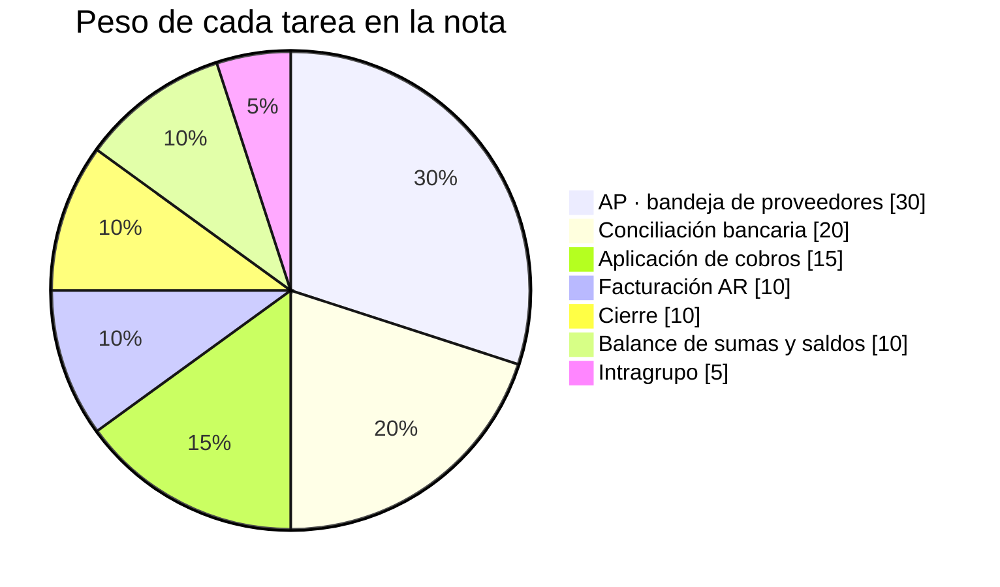

Los asientos se comparan línea a línea por cuenta, socio, centro de coste y elemento PEP, con una tolerancia de ±2 céntimos. El detalle de cada función de `score.py` está en [`PROBLEM.md` §7](PROBLEM.md).

## 4. Las tareas forman una cadena

Cada hecho económico debe registrarse **una sola vez y en el fichero que toca**, porque todos los asientos acaban en el balance. Un error en bancos descuadra también cobros o intragrupo. Por eso el cierre ejecuta las tareas en orden y cada una lee lo que entregaron las anteriores:

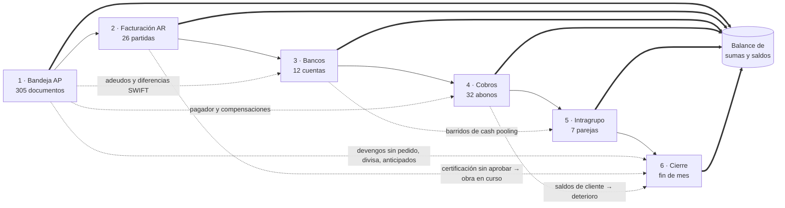

## 5. Arquitectura

### Visión general

Hay tres procesos: el **backend** (`kalmora serve`), que sirve la API `/v1` y el servidor MCP; el **agente de chat** (`kalmora chat`), que consulta los datos por MCP; y el **front** (React + Vite). El cierre se ejecuta como un subproceso (`kalmora close`) que escribe un paquete de ejecución en disco.

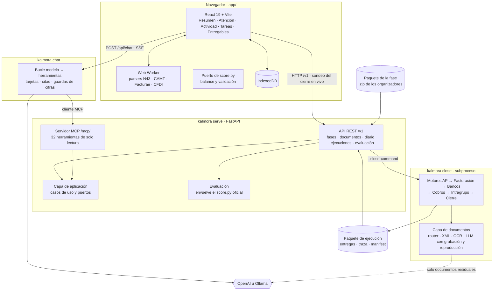

### Principios de diseño

- **Las decisiones contables son deterministas.** Cada motor aplica la política del reto (`POLITICAS_CONTABLES.md`) con reglas explícitas, importes en céntimos enteros y `Decimal` para los tipos de cambio. El mismo paquete produce siempre la misma entrega ([ADR 0002](docs/adr/0002-document-llm-boundary.md)).
- **Los modelos leen; no deciden.** Solo interpretan los documentos que las reglas no resuelven, como escaneos o tablas difíciles. Devuelven datos tipados con su evidencia y el motor contable decide sobre esos datos.
- **Grabación y reproducción.** Cada extracción con un modelo se graba con su huella. Reejecutar un cierre reutiliza las capturas sin llamar al proveedor ni pagar de nuevo.
- **Todo deja rastro.** Cada partida tiene un id `<tarea>:<clave>` y una traza de eventos (`EXTRACT`, `CHECK`, `MATCH`, `DECIDE`, `POST`…) con resultado, referencia a la política y evidencia: documento, ERP, banco, diario o precedente.
- **La referencia está aislada.** Solo el paquete `evaluation/` lee `golden/`, y lo hace a través del `score.py` oficial sin modificarlo, comprobando su sha256 ([ADR 0001](docs/adr/0001-comparator-wraps-official-scorer.md)). Una comprobación estática impide que el código del solver importe la evaluación.
- **El asistente solo lee, y las cifras se copian.** El agente de chat no tiene herramientas de escritura. Cada número de una respuesta tiene que aparecer en el resultado de una herramienta ([ADR 0007](docs/adr/0007-assistant-is-a-separate-read-only-process-over-mcp.md), [ADR 0008](docs/adr/0008-figures-reach-the-user-only-by-copy-from-tool-results.md)).

### El cierre, tarea a tarea

`kalmora close <fase> --out <carpeta>` ejecuta seis módulos en orden. Si uno falla, se marca como fallido y los demás siguen.

| Orden | Módulo | Motor | Lee de la ejecución |
| :---: | --- | --- | --- |
| 1 | **AP** | Híbrido: el motor de reglas v0 decide todos los documentos y el pipeline evidenciado M1 sustituye cada fila que puede resolver con fuentes. Si M1 falla, entrega v0 | — |
| 2 | **Facturación AR** | Lector nativo de las plantillas de soporte y motor tipado; v0 si las fuentes no cubren la fase | — |
| 3 | **Bancos** | Casación global abril–julio en niveles (1:1, N:1, 1:N), clasificación de lo no casado y ajustes ([ADR 0005](docs/adr/0005-bank-rec-matches-globally-and-projects-the-month.md)) | `ap.jsonl` |
| 4 | **Cobros** | Reglas deterministas de aplicación, residuos y compensaciones | `ap.jsonl`, `ar_billing.jsonl` |
| 5 | **Intragrupo** | Conciliación de saldos por pareja de sociedades y causa | entregas de AP y bancos |
| 6 | **Cierre** | Motor de §5 alimentado con las entregas reales de los módulos anteriores | todas las anteriores |

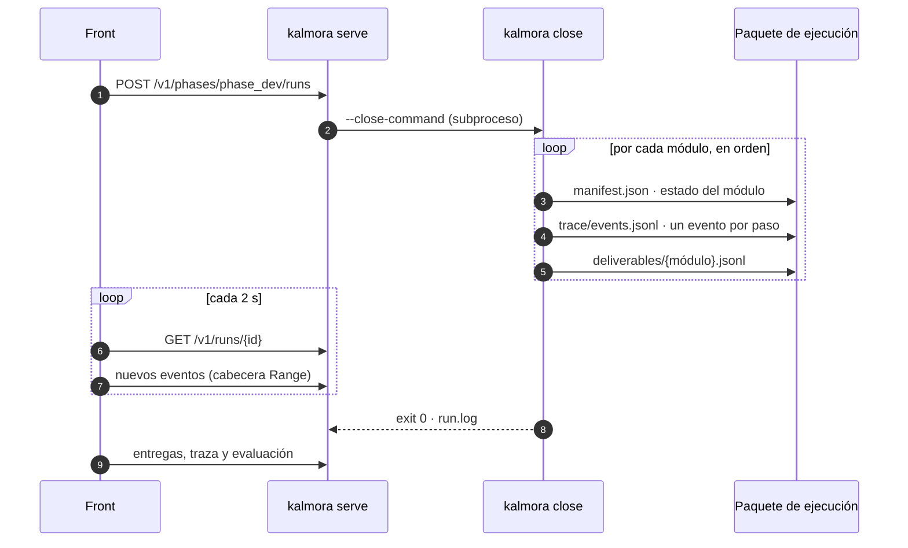

El **paquete de ejecución** es el contrato entre el backend y el front ([`app/CONTRACT.md`](app/CONTRACT.md)):

```text
outputs/runs/<run_id>/
├── manifest.json        estado por tarea, filas, eventos, tiempos, commit, hash de la política, modelos y coste
├── deliverables/        ap · ar_billing · bank_rec · ar_cash · ic · close (.jsonl) + pending_wip.jsonl
├── trace/
│   ├── events.jsonl     un evento por paso de cada partida
│   └── <módulo>.zip     ficheros de trabajo del motor, también si falla
├── run.json             llamadas a modelos, tokens y coste
└── run.log
```

Con solo las seis JSONL, el front deriva el resto: partidas, atención, balance, validaciones y nota.

### Lectura de documentos

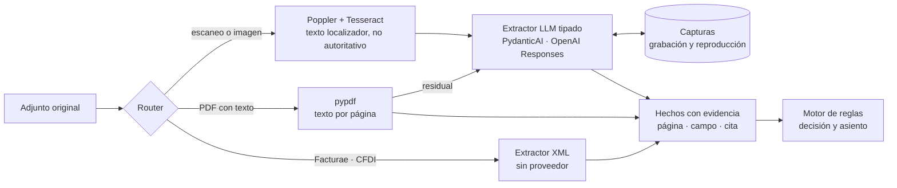

El modelo recibe solo los originales seleccionados y un conjunto acotado de candidatos de la fase. No tiene acceso al sistema de ficheros, SQL, la web ni `golden/`. Cada llamada reserva y liquida presupuesto, y queda registrada con sus tokens y su coste.

### API y MCP

`kalmora serve` publica una API REST bajo `/v1`, documentada con OpenAPI en `/v1/docs`. Los errores siguen `application/problem+json`. La API cubre:

- **Datos:** paquetes y trabajos de ingesta; fases, maestros, tareas, documentos y adjuntos; diario, saldos y partidas abiertas; bancos y tipos de cambio.
- **Asientos:** validación y simulación de asientos, y aritmética exacta.
- **Ejecuciones:** lanzar un cierre; consultar entregas, eventos, atención y partidas; registrar correcciones humanas; evaluarlas en el servidor ([ADR 0006](docs/adr/0006-runs-are-evaluated-on-the-server.md)).

Con `--mcp` monta además un servidor **MCP** (Streamable HTTP) en `/mcp/` sobre la misma capa de aplicación. Expone **32 herramientas de solo lectura** que devuelven como mucho 100 filas. Ninguna puede subir datos, lanzar cierres ni escribir correcciones. Referencia: [`docs/api.md`](docs/api.md) y [`docs/api-contracts.md`](docs/api-contracts.md).

### El asistente

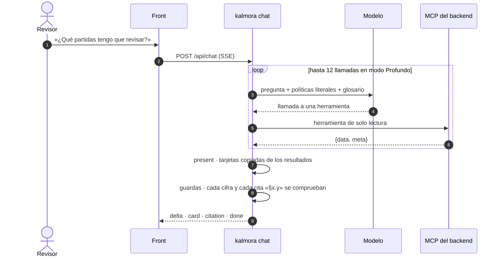

- **Modos.** Rápido (hasta 4 llamadas a herramientas) y Profundo (hasta 12), cada uno con su propio modelo. Con precios configurados, el turno se corta a 0,05 o 0,25 US$.
- **Proveedores.** Ollama (`qwen3:14b` por defecto) u OpenAI (Chat Completions o Responses).
- **Paquete de conocimiento.** Las políticas literales con su hash, el glosario y los flujos de cierre.
- **Sin agente.** Si el front no tiene `VITE_CHAT_URL`, responde un motor local determinista con las mismas cifras que el Resumen.

Diseño completo en [`docs/design/chat-agent.md`](docs/design/chat-agent.md).

### El front

- **Stack.** React 19, react-router 8, Vite 8 y TypeScript, con zustand para el estado.
- **Datos.** La fase se parsea en un Web Worker (comlink). Los formatos Norma 43, CAMT.053, Facturae y CFDI se leen en el propio navegador. La sesión se guarda en IndexedDB.
- **Nota.** Un puerto de `score.py` en TypeScript, con paridad comprobada contra el original, calcula la nota en el navegador cuando la fase trae `golden/`.
- **Diseño.** Sistema de diseño propio con tokens y CSS Modules, sin librería de componentes. Los gráficos, incluido el Sankey de AP, son SVG hechos a mano.
- **Navegación.** Paleta `⌘K` para buscar cualquier id, `⌘J` para abrir el Asistente y atajos `g` + letra.

## 6. La interfaz

Las capturas son del cierre de julio lanzado desde la propia interfaz contra el backend.

### Atención: lo que necesita a una persona

Cada partida que el agente no cierra solo, por prioridad (P0–P3) y tipo: posible fraude, acción fuera del sistema, duda del agente o estimación. La de arriba es un IBAN que no coincide con la ficha del proveedor: la factura queda retenida y no se paga nada hasta confirmarlo fuera del sistema. Las correcciones (`a` aceptar, `p` posponer, `n` nota) se exportan aparte en `overrides.jsonl` y nunca modifican la entrega.

<p align="center">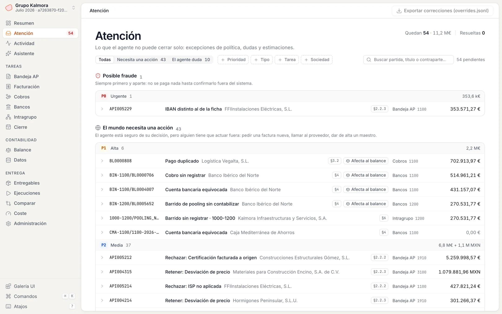</p>

### Actividad: cada decisión, con su razonamiento

Tabla filtrable de las 727 partidas del mes y línea de tiempo de los 1.197 eventos de la traza. Cualquier partida se abre en el panel lateral.

<p align="center">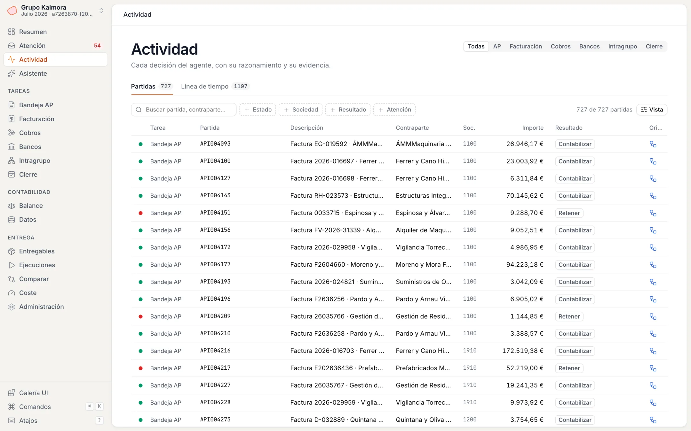</p>

### Panel de partida: la cascada de la política

Cada tarea abre con su mapa de decisión: cuántos documentos siguieron cada rama de la política. El panel de la partida muestra la decisión con su sección (§2.2.5), el documento frente a la ficha maestra y la cascada de comprobaciones. Tiene pestañas para el asiento, la evidencia y la diferencia con la referencia.

<p align="center">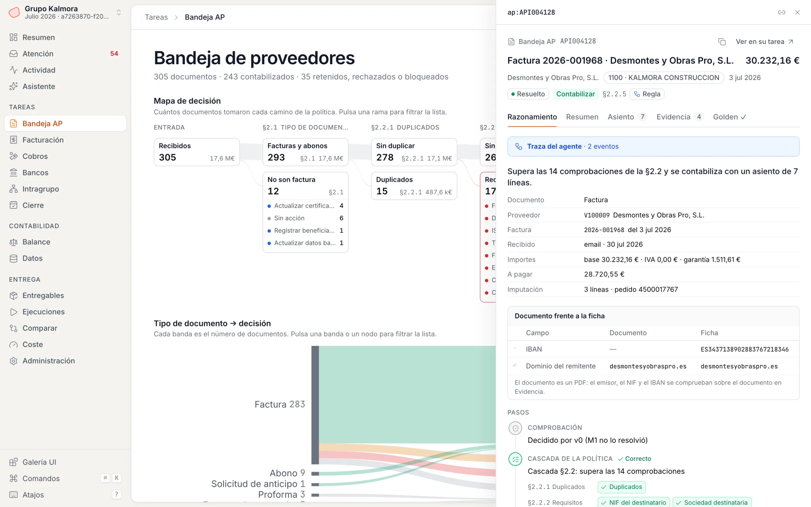</p>

### Bancos: del extracto al libro

El puente de saldo va del extracto a la cuenta 572, antes y después de los ajustes, con el extracto y el libro enfrentados. En el panel, una casación N:1: la nómina en dos lotes contra un solo apunte del libro.

<p align="center">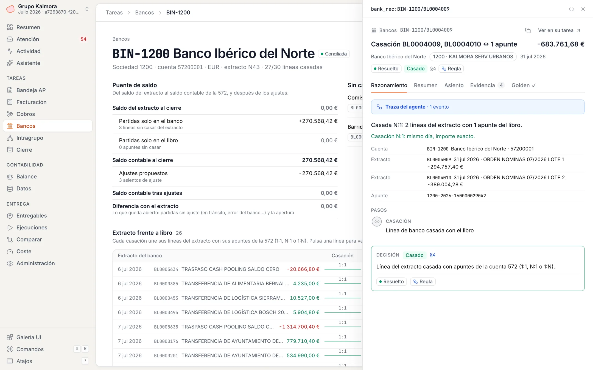</p>

### Asistente

Preguntas en lenguaje natural sobre la fase y sus ejecuciones. Las respuestas traen tarjetas con cifras copiadas de los datos, partidas enlazadas al panel y citas a la política. En la captura responde el motor local del front.

<p align="center">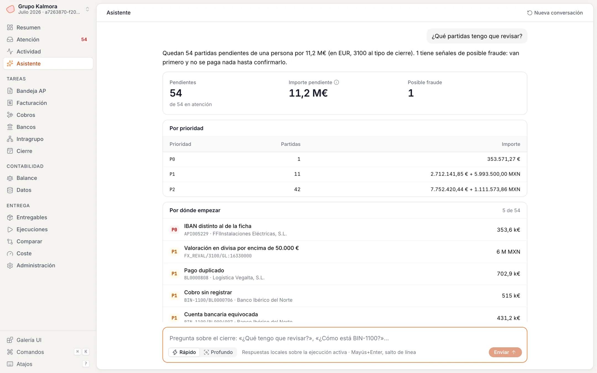</p>

### Cierre en vivo

«Cerrar el mes» lanza `kalmora close` en el backend y la interfaz sigue el progreso de cada tarea y los eventos a medida que se escriben.

<p align="center">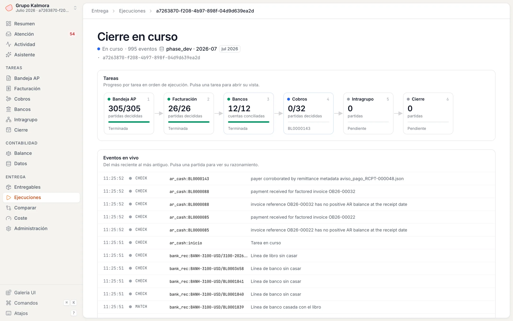</p>

### Comparar con la referencia

Con `golden/` disponible, la nota se calcula igual que `score.py`, tarea a tarea, y cada partida que difiere aparece ordenada por los puntos que pierde.

<p align="center">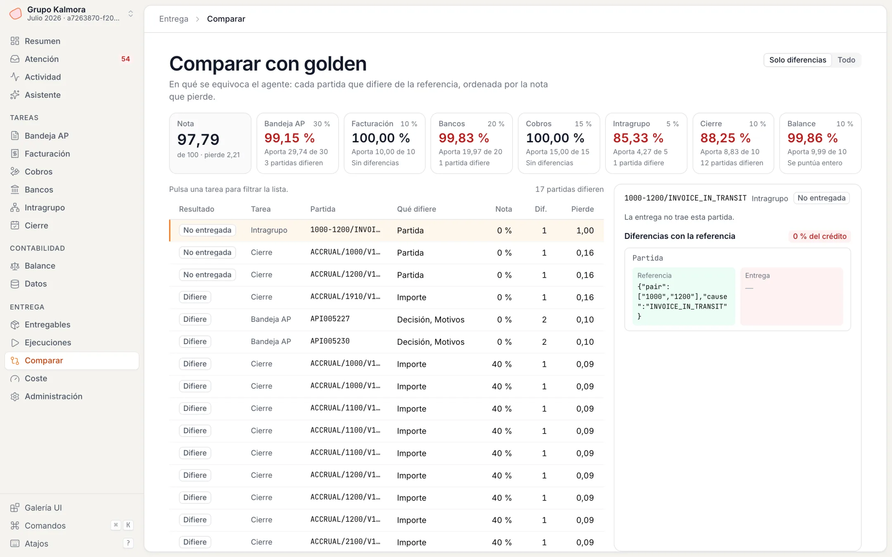</p>

<details>
<summary><b>Todas las pantallas</b></summary>

| Pantalla | Ruta | Qué muestra |
| --- | --- | --- |
| Resumen | `/` | Frase de apertura, indicadores, proceso del cierre y «Te necesitan» |
| Atención | `/atencion` | Excepciones por prioridad y tipo, con correcciones exportables |
| Actividad | `/actividad` | Todas las partidas y la línea de tiempo de eventos |
| Asistente | `/asistente` · `⌘J` | Preguntas sobre la fase y la ejecución |
| Bandeja AP | `/tareas/ap` | Mapa de decisión §2.2, Sankey tipo de documento → decisión y visor del documento |
| Facturación | `/tareas/facturacion` | Facturas emitidas y certificaciones pendientes de aprobación |
| Cobros | `/tareas/cobros` | Qué paga cada abono, residuos y abonos que no son de clientes |
| Bancos | `/tareas/bancos[/:cuenta]` | Rejilla de cuentas, puente de saldo y banco frente a libro |
| Intragrupo | `/tareas/intragrupo` | Matriz de parejas y ficha de cada diferencia |
| Cierre | `/tareas/cierre` | Partidas de fin de mes por tipo |
| Balance | `/balance` | Sumas y saldos: registrado + entregado frente a correcto, y mapa de calor sociedad × grupo de cuentas |
| Datos | `/datos/*` | Maestros, diario paginado, documentos y extractos |
| Entregables | `/entregables` | Validación de los 6 ficheros, nota y descarga del zip de entrega |
| Ejecuciones | `/ejecuciones` | Nuevo cierre, ejecuciones remotas y seguimiento en vivo |
| Comparar | `/comparar` | Diferencias con la referencia, campo a campo |
| Coste | `/coste` | Modelos, tokens, coste y tiempo por tarea |

</details>

## 7. Resultados

### Julio (`phase_dev`)

Ejecución `a7263870` del 5 de octubre de 2026, lanzada desde la interfaz y puntuada con el `score.py` oficial:

| Tarea | Peso | Nota | Aporta |
| --- | :---: | ---: | ---: |
| Bandeja AP | 30 % | 99,15 % | 29,74 |
| Conciliación bancaria | 20 % | 99,83 % | 19,97 |
| Aplicación de cobros | 15 % | 100,00 % | 15,00 |
| Facturación AR | 10 % | 100,00 % | 10,00 |
| Cierre | 10 % | 88,25 % | 8,83 |
| Balance de sumas y saldos | 10 % | 99,86 % | 9,99 |
| Intragrupo | 5 % | 85,33 % | 4,27 |
| **Total** | | | **97,79** |

La nota ha subido así: 38,83 → 88,03 al encadenar los motores reales ([#268](https://github.com/alfonsomayoral/talky-labs-hackathon/pull/268)), 96,90 → 97,36 y 97,36 → 97,79 al llevar cobros al 100 % ([#291](https://github.com/alfonsomayoral/talky-labs-hackathon/pull/291)).

### Modelo, coste y tiempo

| | |
| --- | --- |
| **Cierre completo** | 127–135 s en local; esta ejecución, 133 s |
| **Coste de modelos del cierre** | 0 US$: las decisiones son reglas y la lectura de documentos reproduce capturas grabadas |
| **Modelo de lectura de documentos** | `gpt-6-luna` (OpenAI Responses, razonamiento bajo), solo para documentos residuales |
| **Coste medido de lectura con modelo** | 0,004–0,006 US$ por documento; 0,06–0,07 US$ por escaneo ([detalle](docs/september-document-hardening.md)) |
| **Asistente** | Ollama `qwen3` en local u OpenAI; con precios configurados, tope de coste por turno |

### Septiembre (`phase_test`)

Septiembre no tiene referencia oficial. Como control interno, se contrasta con una referencia **predicha** a partir de los prototipos de investigación ([`fixtures/eval_phase_test/`](fixtures/eval_phase_test/README.md)), que no es la oficial. Contra ella, el cierre de septiembre obtiene 96,42. Esa cifra mide el acuerdo con los prototipos, no la nota real.

## 8. Puesta en marcha

Requisitos: Python 3.12 o superior y Node 22.

```bash
# Backend
python3 -m venv .venv
.venv/bin/python -m pip install -e '.[api,mcp,assistant,documents]'

# Front
cd app && npm install && cp .env.example .env.local && cd ..
```

Tres terminales, desde la raíz del repo:

```bash
set -a; source .env; set +a
PYTHONPATH=src .venv/bin/python -m kalmora serve --port 8001 --mcp \
  --close-command '.venv/bin/python -m kalmora close {phase_dir} --out {out}'
```

```bash
PYTHONPATH=src .venv/bin/python -m kalmora chat --port 8110
```

```bash
npm --prefix app run dev
```

Con `VITE_API_URL=http://127.0.0.1:8001` y `VITE_CHAT_URL=http://127.0.0.1:8110` en `app/.env.local`, abre `http://localhost:5173`. Ve a **Ejecuciones → Nuevo cierre**, sube el `.zip` de la fase y pulsa **Cerrar el mes**. Para ver la nota en julio, arranca el backend con `--evaluator <carpeta del paquete>`.

La guía completa, con variables, puertos y problemas frecuentes, está en [`docs/local-setup.md`](docs/local-setup.md).

<details>
<summary><b>Solo la línea de comandos</b></summary>

```bash
.venv/bin/kalmora import-package /ruta/participant.zip --destination data/julio
.venv/bin/kalmora inspect data/julio/participant/phase_dev
.venv/bin/kalmora close data/julio/participant/phase_dev --out outputs/runs/julio
.venv/bin/kalmora evaluate data/julio/participant/phase_dev outputs/runs/julio/deliverables \
  --evaluator data/julio/participant/phase_dev --text
```

Cada módulo tiene también su comando: `solve-ap`, `solve-ar-billing`, `solve-bank-rec`, `solve-ar-cash`, `prepare-ap`, `run-ap`… Consulta `kalmora --help`.

</details>

## 9. Calidad y verificación

- **Backend:** 126 ficheros de test con unittest y unas 1.400 pruebas. Se ejecutan con `PYTHONPATH=src python -m unittest discover -s tests`.
- **Front:** 57 ficheros de test con Vitest y Testing Library, unas 355 pruebas. Incluyen la paridad del puerto de `score.py` contra el original con los datos de julio. Se ejecutan con `npm --prefix app test`.
- **Evaluación del asistente:** [`evals/assistant/`](evals/assistant) mide pass^k, pass@k, latencia, tokens y coste, y busca secretos en las respuestas.
- **CI:** en las ramas de los milestones, GitHub Actions compila, ejecuta la suite completa y `kalmora doctor` en Python 3.12 y 3.13.
- **Decisiones de arquitectura:** registradas como ADR en [`docs/adr/`](docs/adr).

## 10. Estructura del repositorio

```text
.
├── src/kalmora/            backend · ~38.000 líneas de Python
│   ├── cli.py              punto de entrada `kalmora`
│   ├── closing.py          orquestador del cierre
│   ├── ap_*.py             pipeline evidenciado de AP (M1)
│   ├── v0/                 motores de reglas portados de los prototipos
│   ├── billing/            facturación AR (M2)
│   ├── bankrec/            conciliación bancaria (M3)
│   ├── ar_cash/            aplicación de cobros (M4)
│   ├── ic/                 intragrupo (M5)
│   ├── close/              asientos de cierre (M6)
│   ├── documents/          router, XML, OCR, extractor LLM, grabación y reproducción
│   ├── llm/                cliente tipado con presupuesto
│   ├── landing/            base DuckDB de ingesta y parsers bancarios
│   ├── app/ · infra/       capa de aplicación y adaptadores
│   ├── api/ · mcp/         FastAPI y servidor MCP
│   ├── assistant/          agente de chat
│   └── evaluation/         el único código que lee golden
├── app/                    front · React + Vite + TypeScript
├── tests/                  suite del backend
├── evals/assistant/        evaluación del agente de chat
├── fixtures/               referencia predicha de septiembre y anotaciones
├── tools/                  scripts de evaluación y validación por milestone
├── knowledge/              mapa de conocimiento, flujos de cierre y referencias de datos
├── docs/                   diseño, ADR, contratos, verificaciones y releases
├── PROBLEM.md              el problema, los datos y el evaluador, en detalle
└── CONTEXT.md              vocabulario del dominio
```

## 11. Documentación

| Tema | Documento |
| --- | --- |
| El problema completo: datos, tareas, formato y evaluador | [`PROBLEM.md`](PROBLEM.md) |
| Vocabulario del dominio | [`CONTEXT.md`](CONTEXT.md) |
| Levantar el entorno local | [`docs/local-setup.md`](docs/local-setup.md) |
| API HTTP y contratos | [`docs/api.md`](docs/api.md) · [`docs/api-contracts.md`](docs/api-contracts.md) |
| Contrato front ↔ backend | [`app/CONTRACT.md`](app/CONTRACT.md) |
| Front: arranque, recorrido y estructura | [`app/README.md`](app/README.md) |
| Agente de chat | [`docs/design/chat-agent.md`](docs/design/chat-agent.md) · [`docs/design/chat-agent-harness.md`](docs/design/chat-agent-harness.md) |
| Conciliación bancaria | [`docs/design/bank-rec.md`](docs/design/bank-rec.md) |
| Facturación AR | [`docs/design/ar-billing.md`](docs/design/ar-billing.md) |
| Cierre: método y resultados | [`docs/m6/`](docs/m6) |
| Cliente LLM y lectura de documentos | [`docs/llm-client.md`](docs/llm-client.md) · [`docs/document-extraction.md`](docs/document-extraction.md) |
| Decisiones de arquitectura | [`docs/adr/`](docs/adr) |
| Releases | [`docs/releases/`](docs/releases) |

## 12. Limitaciones conocidas

- **Cierre (88 %).** Las periodificaciones son estimaciones. Faltan algunas y otras quedan fuera de la tolerancia de la política (±15 %).
- **Intragrupo (85 %).** En la cadena completa no se detecta una factura en tránsito entre `1000` y `1200`. El módulo aislado sí detecta las cinco diferencias de la referencia, pero declara además tres facturas en tránsito con soporte documental. Eso lo limita a 0,8615 ([detalle](docs/m5-score-resolution.md)).
- **Lectura con modelo en AP.** En la ejecución de referencia, el motor de reglas v0 decide los 305 documentos y no se llama a ningún modelo. El pipeline evidenciado M1, que usa el modelo para los documentos residuales, está integrado en el cierre pero no aporta filas en esa ejecución.
- **Ambigüedades de la política.** [`PROBLEM.md` §11.2](PROBLEM.md) recoge 35 preguntas que la política no resuelve. Se resuelven con el histórico y la referencia de julio.
- **Interfaz.** Solo tiene tema claro.

---

<div align="center">
<sub>Los datos de Grupo Kalmora son sintéticos y pertenecen a los organizadores del reto; este repositorio no los incluye. Los NIF llevan un dígito de control incorrecto a propósito y los tipos de cambio son una serie sintética.</sub>
</div>
